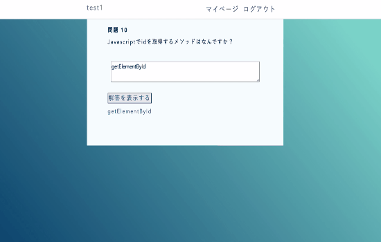
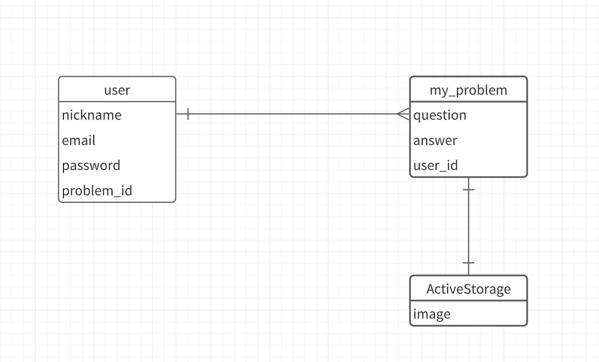

# README

## アプリ名
Study-training

## アプリの概要
このアプリケーションは、勉強をするためのものです。  
自分で問題を作り、その問題を自分で解きます。  
作った問題を編集したり削除することもできます。

## 作成背景  
私は学生の頃、勉強していたとき参考書に復習するためたくさんの付箋を貼り、毎日そこを復習していました。  
日に日に付箋の数も増えていき、参考書が付箋でビラビラになり、ページをめくりづらくなり、勉強しづらくなりました。さらにページをめくるのがめんどくさく、モチベーションが低下していました。  
なので、何度も復習するような問題は、携帯やタブレットなどで手軽に勉強したいと思ったのでこのアプリケーションを作ろうと思いました。  

## 実装した機能  
  
### 問題作成機能  
問題に画像も載せることができるようにしました。  

  
### 問題を解く機能
ここの機能に関しては、Javacriptで回答を表示させています

  
### 問題の編集と削除
問題の編集と削除は、マイページから自分が作成した問題の一覧が表示されるのでそこの「 編集 」というリンクからできます

  
### ユーザー管理機能
ログインや新規登録をおこないます。ログインしていない状態で他のページにいこうとすると　にとばされます

  
## 実装予定の内容
・英語や数学などの問題  
・問題の検索機能

## ER図  

